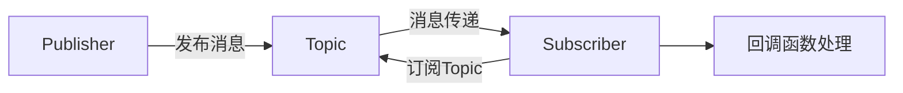

# ROS2 Topic Subscriber 基础知识与应用

---

## 概述
ROS2中的**Subscriber（订阅者）**是节点间通信的核心组件之一，用于**接收其他节点通过Topic发布的消息**。Subscriber通过订阅特定主题（Topic）获取数据，并通过回调函数处理消息，是实现机器人感知、控制等功能的基础。例如，激光雷达数据订阅、图像处理等场景均依赖Subscriber。

---

## 核心概念

### 1. Subscriber的作用
- **数据接收**：从Publisher发布的Topic中获取实时数据。
- **回调机制**：通过回调函数（Callback）处理接收到的消息。
- **异步通信**：与Publisher解耦，支持一对多和多对多通信。

### 2. 通信流程


### 3. 与Publisher的区别
| 特性                | Subscriber                          | Publisher                          |
|---------------------|-------------------------------------|------------------------------------|
| **功能**            | 接收消息                            | 发布消息                           |
| **回调机制**        | 必须定义回调函数处理消息            | 无需回调函数                       |
| **消息处理**        | 实时处理接收到的数据                | 仅负责消息的生成和发布             |

### 4. 生命周期
1. **注册订阅**：节点启动时向ROS2系统注册订阅的Topic。
2. **接收消息**：持续监听Topic，等待消息到达。
3. **回调触发**：消息到达时触发预定义的回调函数。
4. **数据处理**：在回调函数中解析并处理消息内容。

---

## 常用指令及用法

### 1. 查看系统中所有Topic
```bash
ros2 topic list
```
**示例输出**：
```
/camera/depth/image_raw
/cmd_vel
/odom
/scan
```

### 2. 查看Topic的详细信息
```bash
ros2 topic info <topic_name>
```
**示例**：查看`/cmd_vel`的详细信息：
```bash
ros2 topic info /cmd_vel
```
**输出内容**：
- 消息类型：`geometry_msgs/msg/Twist`
- 发布者（Publisher）数量：1
- 订阅者（Subscriber）数量：2
- QoS配置（如可靠性、持久性）

### 3. 实时查看Topic数据
```bash
ros2 topic echo <topic_name>
```
**示例**：查看`/cmd_vel`的实时数据：
```bash
ros2 topic echo /cmd_vel
```
**输出示例**：
```
linear:
  x: 0.5
  y: 0.0
  z: 0.0
angular:
  x: 0.0
  y: 0.0
  z: 0.2
```

### 4. 查看Topic的消息类型
```bash
ros2 topic type <topic_name>
```
**示例**：
```bash
ros2 topic type /cmd_vel
# 输出：geometry_msgs/msg/Twist
```

### 5. 查看消息结构
```bash
ros2 interface show <msg_type>
```
**示例**：查看`Twist`消息的结构：
```bash
ros2 interface show geometry_msgs/msg/Twist
```
**输出**：
```yaml
float64 x
float64 y
float64 z
---
float64 x
float64 y
float64 z
```

### 6. 测量消息发布频率
```bash
ros2 topic hz <topic_name>
```
**示例**：查看`/scan`话题的频率：
```bash
ros2 topic hz /scan
```
**输出示例**：
```
average rate: 10.002 Hz
max latency: 0.099999s
min latency: 0.090000s
```

### 7. 取消订阅（高级场景）
ROS2中默认无法直接通过指令取消订阅，需通过代码或停止节点实现。若需动态管理订阅，需在代码中实现条件判断或使用`rclcpp`的`Subscription`对象的`cancel()`方法。

---

## 应用示例：小乌龟运动控制

### 步骤1：启动Publisher节点
```bash
ros2 run turtlesim turtle_teleop_key
```
（按方向键生成`/turtle1/cmd_vel`话题数据）

### 步骤2：订阅并查看运动指令
```bash
ros2 topic echo /turtle1/cmd_vel
```
**终端输出**：
```
linear:
  x: 2.0
  y: 0.0
  z: 0.0
angular:
  x: 0.0
  y: 0.0
  z: 1.5
```

### 步骤3：编写Subscriber节点（Python示例）
```python
# subscriber.py
import rclpy
from rclpy.node import Node
from geometry_msgs.msg import Twist

class MinimalSubscriber(Node):
    def __init__(self):
        super().__init__('minimal_subscriber')
        self.subscription = self.create_subscription(
            Twist,
            '/turtle1/cmd_vel',
            self.listener_callback,
            10)
        self.subscription  # 避免警告

    def listener_callback(self, msg):
        self.get_logger().info(f'Received: Linear={msg.linear.x}, Angular={msg.angular.z}')

def main(args=None):
    rclpy.init(args=args)
    minimal_subscriber = MinimalSubscriber()
    rclpy.spin(minimal_subscriber)
    minimal_subscriber.destroy_node()
    rclpy.shutdown()

if __name__ == '__main__':
    main()
```

### 步骤4：运行Subscriber节点
```bash
ros2 run your_package_name subscriber
```

---

## 常见问题与解决

### 问题1：无法接收到消息
**可能原因**：
- Topic名称拼写错误。
- Publisher未启动或未发布消息。
- QoS配置不匹配（如可靠性、持久性设置）。
**解决方法**：
```bash
# 检查Publisher是否运行
ros2 node list | grep turtle_teleop_key

# 确认Topic存在
ros2 topic list | grep cmd_vel
```

### 问题2：消息类型不匹配
**现象**：运行`ros2 topic echo`时提示`No type specified`。
**解决方法**：
```bash
# 显式指定消息类型
ros2 topic echo /cmd_vel geometry_msgs/msg/Twist
```

### 问题3：回调函数未触发
**可能原因**：
- 订阅的Topic未正确初始化。
- 节点未进入`spin()`循环。
**解决方法**：
```python
# 确保代码包含spin循环
rclpy.spin(node)
```

---

## 扩展阅读
- [ROS2 Humble 官方文档](https://docs.ros.org/en/humble/Tutorials.html) 
---

通过本文，您已掌握ROS2 Subscriber的核心概念、常用指令及开发实践。结合小乌龟案例和代码示例，能够高效实现数据订阅与处理功能。
