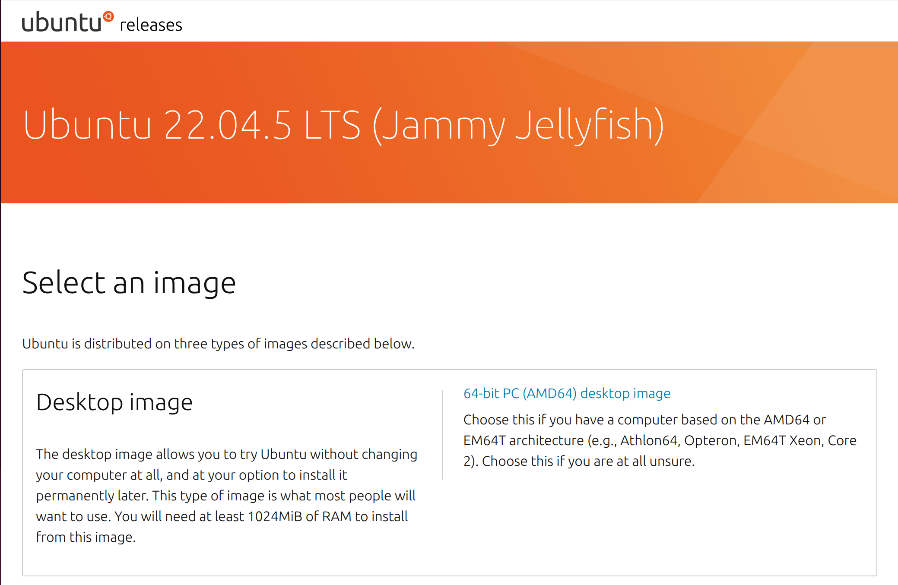
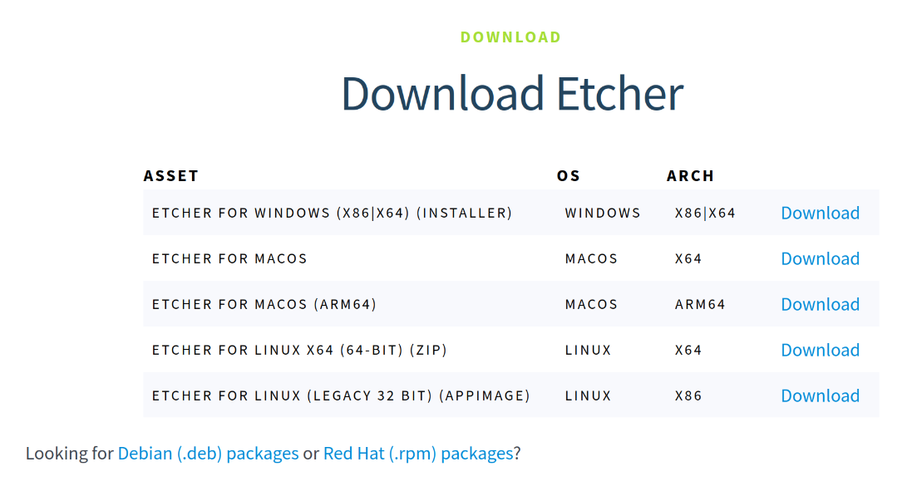
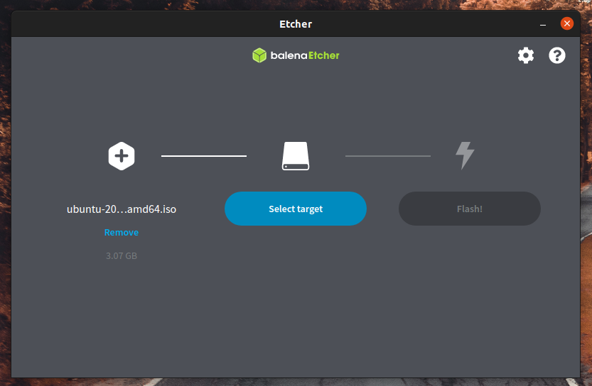

# 安装 Ubuntu 桌面

在本教程中，我们将在您的笔记本电脑或 PC 上下载并安装 Ubuntu Desktop 22.04 LTS。

如果您从未安装过操作系统，也不用担心：Ubuntu 让安装过程变得非常简单。您将看到一个引导式安装程序，它会询问您几个问题。如果您不确定该选择哪个，可以直接选择默认选项，这样可以确保您最终获得一个完全可用的 Ubuntu 安装。无需深厚的技术知识。

您需要：

- 具有至少 64GB 存储空间的笔记本电脑或 PC。
- 建议使用 12GB 或以上的USB闪存驱动器。

## Ubuntu 能在我的电脑上运行吗？

虽然 Ubuntu 可以在各种设备上运行，但最好使用[Ubuntu 认证硬件](https://ubuntu.com/certified?q=&category=Laptop&category=Desktop&limit=20)页面上列出的设备。这些设备已经过测试，并确认可以与 Ubuntu 良好兼容。

如果您在那里看不到您的设备，您可以随时[尝试 Ubuntu 桌面](https://documentation.ubuntu.com/desktop/en/latest/tutorial/try-ubuntu-desktop/#try-ubuntu-desktop)并检查一切是否按预期运行。

## 备份你的数据

如果您要在以前使用过的 PC 或笔记本电脑上安装 Ubuntu，请在开始安装之前备份数据：

- 将您想要保留的任何**文件移动到另一个存储设备，例如外部磁盘或 USB 驱动器。**
- 要备份您的**网页浏览器**，请将您的浏览器连接到在线帐户，例如 Firefox 帐户或 Google 帐户。Ubuntu 安装完成后，当您登录帐户时，浏览器会同步您的数据。请注意，Safari 浏览器在 Ubuntu 上无法使用。

备份**USB 闪存盘中**的文件。驱动器上的内容将被清除。

## 下载 Ubuntu 镜像

[从下载 Ubuntu 桌面](https://releases.ubuntu.com/jammy/)页面获取 Ubuntu 安装镜像。将其保存到电脑上一个容易记住的位置。下载的文件名`ubuntu-22.04.5-desktop-amd64.iso`类似。

## 创建可启动的 USB 盘

将下载的 Ubuntu 镜像写入 U 盘以创建安装介质。这与复制下载的镜像文件不同：您需要使用特殊的软件。

我们将使用 balenaEtcher 应用程序，因为它可以在 Linux、Windows 和 macOS 上运行。

> [!WARNING]
>
> 这将清除你的U盘。请先备份你的文件。

1. [在balenaEtcher 网站](https://etcher.balena.io/)上，选择与您当前操作系统相对应的版本。

2. xxxxxxxxxx ros2 topic listshell

   

3. 插入您的 USB 闪存驱动器。

4. 打开 balenaEtcher。

5. 选择下载的 Ubuntu 映像和您的 USB 闪存驱动器。

   

6. 单击Flash！写入图像。

现在您有一个可用作 Ubuntu 安装介质的 USB 记忆棒。

## 从 USB 闪存驱动器启动

1. 将 USB 记忆棒插入您想要安装 Ubuntu 的笔记本电脑或 PC。

2. 重新启动计算机。

3. 您的设备应该识别安装媒体并启动 Ubuntu 安装程序。

   如果没有，请重新启动。这次，启动时按住F12 。在出现的启动菜单中，选择您的 USB 设备。

   F12是调出系统启动菜单最常用的按键，但Escape、F2和F10也是常用的替代键。如果不确定，请在系统启动时查看一条简短消息：这通常会告知您应该按哪个键来访问启动菜单。您也可以在笔记本电脑或 PC 的文档中找到正确的按键。
   
   

## 安装程序

Ubuntu 桌面安装程序打开。之后就可以根据图形化引导进行安装了；

[HOME](../入门.md)
