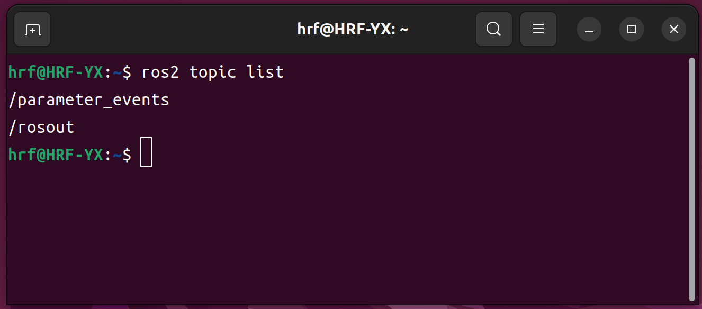

# 安装 ROS2 Humble

如果您是初学者，我们强烈建议您使用一键安装脚本，一键安装与手动安装所呈现的运行环境是一致的，但一键安装能够为您规避掉很多意料之外的问题。

#### 自动安装ROS2

- [ ] 我们只需要在新的Shell终端运行下面这条指令，选择对应的序号，剩下的就交给时间吧。

> [!NOTE]
>
> 快速打开一个新的Shell终端需要您按下键盘上 Ctrl + AIt + T   稍作等候，新的终端将出现在您的窗口。

```shell
wget http://fishros.com/install -O fishros && . fishros
```

- [ ] 接着根据提示信息输入你需要的选项对应的序号。

一般情况下你需要依次选择如下内容：

```shell
	[1]: 一键安装(推荐):ROS(支持ROS/ROS2,树莓派Jetson) 
```

```shell
	[1]: 更换系统源再继续安装
```

```shell
	[2]: 更换系统源并清理第三方源
```

```shell
	[1]: 自动测速选择最快的源
```

```shell
	[1]: 中科大镜像源
```

```shell
	[1]: humble(ROS2)桌面版 
```

安装过程中需要确保网络畅通，等待20min左右即可完成ROS2 Humble 的安装；

---


#### 手动安装ROS2

- [ ] 您可以参考ROS2官方提供的安装说明进行安装。

https://docs.ros.org/en/humble/Installation/Ubuntu-Install-Debs.html

> [!WARNING]
>
> 虽然我们给出了手动安装的选项，但是仍然不建议你选择手动安装，除非您有能力解决可能出现的问题。


---


#### 简单测试

接下来不妨打开一个新的Shell终端，在新的Shell终端运行下面这条指令：

```shell
ros2 topic list
```

观察终端中是否和预期一样输出话题列表：



如果输出了内容，则表明ROS2已经安装到系统当中；


[HOME](../入门.md)
