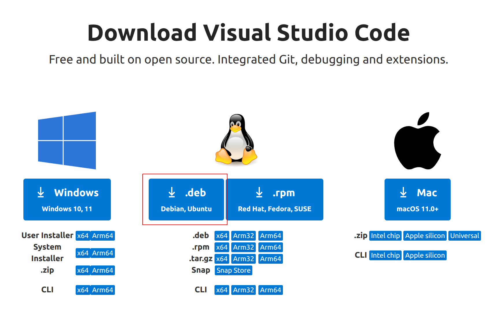
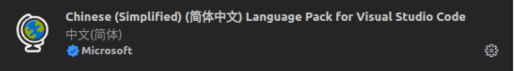
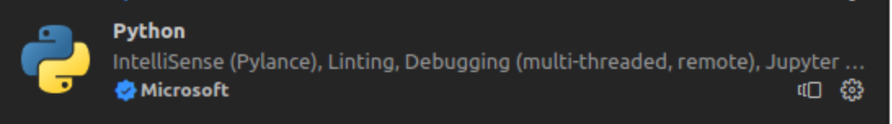

# 安装 VS Code

### 下载 Visual Studio Code

我们需要安装Visual Studio Code软件，因为他能够提高我们的开发效率。

- [ ] ####   [Visual Studio Code](http://code.visualstudio.com/Download)	： https://code.visualstudio.com/Download

您需要在 Visual Studio Code 的官方网站中选择您所使用平台的对应版本。



> [!NOTE]
>
> 本节和所有Linux示例均使用Ubuntu Desktop 22.04 LTS 完成并测试。	

- [ ] 下载完成后您将得到如下文件 （其中1.95.2-1730981514为版本号，可能会有所变更）	

```shell
code_1.95.2-1730981514_amd64.deb
```

---


### 安装 Visual Studio Code

在Linux中安装软件一般情况下需要用到dpkg指令，没有接触过也不要担心，我们会提供具体的安装指令。

- [ ] 1. 首先需要找到刚刚下载的 VS Code 安装文件，您需要选中这个文件并且右击鼠标复制文件。

> [!NOTE]
>
> 在linux中复制文件后会得到文件路径！所以不必担心。

- [ ] 2. 接着打开一个新的Shell终端，输入下面的安装指令，并将您刚刚复制的文件路径粘贴在后方。

就像这样，其中 sudo dpkg -i 为安装指令，后面内容为安装文件的路径

```shell
sudo dpkg -i /home/xxx/下载/code_1.95.2-1730981514_amd64.deb
```

> [!NOTE]
>
> 卸载Visual Studio Code使用 ： sudo dpkg --purge  code

---


### 配置 Visual Studio Code

我们需要对编辑器进行简单的配置，使其能够更高效的运行。

首先点击侧边栏的Extensions(插件)选项或者使用快捷键`Ctrl+Shift+X`打开插件窗口

- [ ] 1. 安装简体中文语言支持。



- [ ] 2. 安装Python插件。




[HOME](../入门.md)
